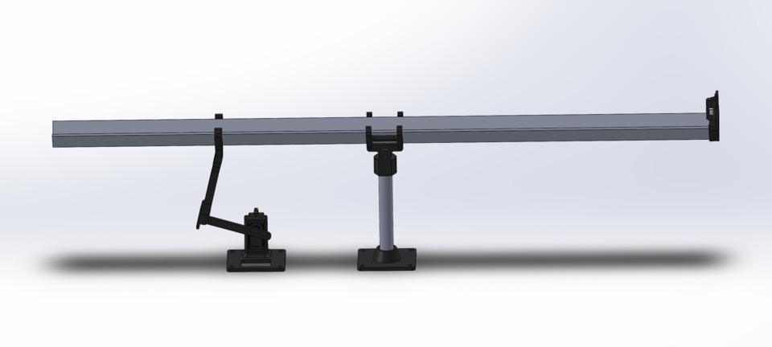

# Equilíbrio da Bolinha com ESP32



Este projeto utiliza um ESP32 para controlar um sistema de equilíbrio de uma bolinha em uma plataforma. O controle é realizado por um servo motor, um sensor ultrassônico e um encoder rotativo, utilizando um controlador PID para ajustar a posição da plataforma conforme a distância medida.

## Funcionalidade do Sistema
O sistema mede a distância da bolinha utilizando um sensor ultrassônico e ajusta a inclinação da plataforma através de um servo motor. O controle é feito utilizando um controlador PID, que calcula o erro entre a distância medida e a distância desejada (setpoint), aplicando correções para manter a bolinha estável.

## Controle PID
O controlador PID (Proporcional, Integral e Derivativo) é utilizado para ajustar dinamicamente a inclinação da plataforma e manter a bolinha na posição desejada.

- **P (Proporcional):** Responsável pela resposta imediata ao erro.
- **I (Integral):** Acumula os erros ao longo do tempo para corrigir desvios sistemáticos.
- **D (Derivativo):** Suaviza as oscilações reagindo às variações rápidas do erro.

Os parâmetros podem ser ajustados durante a execução utilizando o encoder rotativo, permitindo um ajuste fino para melhor estabilidade.

# Peças
As partes 3d do projeto estão disponíveis [neste link](https://grabcad.com/library/pid-ball-on-beam-balancer-1)

## Instalação e Configuração
### Requisitos
- **Placa ESP32**
- **Servo motor**
- **Sensor ultrassônico (HC-SR04 ou similar)**
- **Encoder rotativo com botão**
- **Display LCD 16x2 (opcional)**
- **Bolinha de ping pong**

### Bibliotecas Necessárias
Instale as seguintes bibliotecas na IDE Arduino:

1. **ESP32Servo** - Para controle do servo motor
   ```
   Sketch -> Incluir Biblioteca -> Gerenciar Bibliotecas -> Buscar "ESP32Servo" e instalar
   ```
2. **LiquidCrystal** - Para exibir informações no LCD
   ```
   Sketch -> Incluir Biblioteca -> Gerenciar Bibliotecas -> Buscar "LiquidCrystal" e instalar
   ```
### Execução
1. Conecte todos os componentes conforme o esquema de ligação
2. Ajuste os parâmetros do PID com o encoder rotativo
3. O sistema irá controlar automaticamente o servo motor para equilibrar a bolinha

## Ajuste dos Parâmetros PID
O encoder rotativo permite modificar os valores de **Kp, Ki e Kd** em tempo real. O botão do encoder muda qual parâmetro está sendo ajustado:
- **1º clique:** Ajusta Kp (Proporcional)
- **2º clique:** Ajusta Kd (Derivativo)
- **3º clique:** Ajusta Ki (Integral)

Os valores são exibidos no LCD.

## Autor
Projeto desenvolvido para controle de equilíbrio de uma bolinha usando ESP32 e controle PID por Jullie Quadros, Gustavo Sarti, Elder Storck e José Vitor Zorzal.

---
**Observação:**
Se o sistema estiver instável, ajuste os parâmetros PID para melhorar o controle da plataforma.

